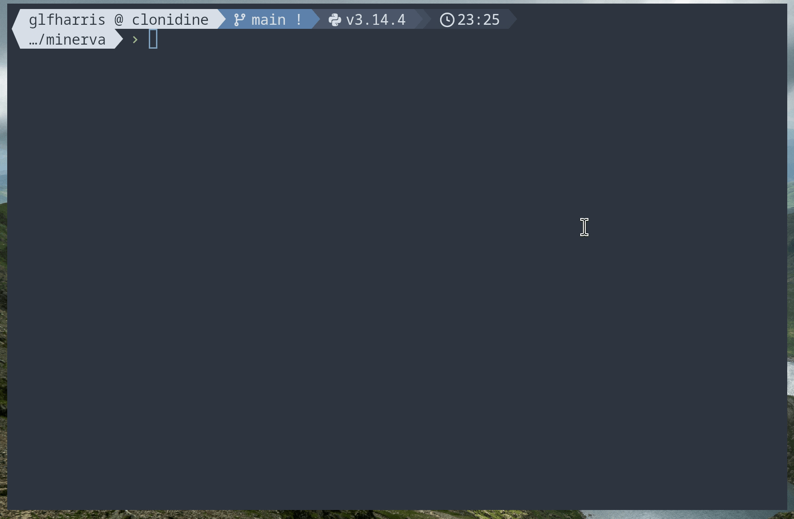

# Minerva
#### LLM-based Single Best Answer Question Generation



## Rationale

High-quality question banks for postgraduate medical examinations are expensive, often charging significant sums for access — with little reduction in price for candidates who need to resit. Given the capabilities of modern LLMs, there is no good reason for this to remain the case.

Minerva generates Single Best Answer (SBA) questions from your own reference material using retrieval-augmented generation, with the aim of producing questions that meet the standard of those written by human examiners.

## Setup

Minerva uses `uv` as its package manager. Install it for your operating system before proceeding, then install dependencies:

```bash
uv sync
```

Copy `.env.example` to `.env` and fill in your API keys:

```
OPENAI_API_KEY=        # required if using OpenAI models
ANTHROPIC_API_KEY=     # required if using Anthropic/Claude models
MINERVA_MODEL=openai:gpt-5.5
LANCEDB_DIR=./lancedb
```

Embeddings use `NeuML/pubmedbert-base-embeddings` locally — no API key required for embedding.

## Usage

**1. Embed your reference documents** (a folder of PDFs):

```bash
./mincli.py embed path/to/docs/

# Show per-file progress and chunk-level detail
./mincli.py embed path/to/docs/ --verbose

# Reset existing embeddings and re-embed from scratch
./mincli.py embed path/to/docs/ --reset
```

PDFs are split into overlapping 300-word chunks. Tables are extracted atomically as markdown to avoid splitting across chunks. Already-embedded files are skipped automatically on subsequent runs.

**2. Generate questions:**

```bash
# Single question on a topic
./mincli.py create "Lung Compliance"

# Multiple questions, saved to a directory
./mincli.py create "Cardiac Output" --count 3 --output ./output

# Save to a specific file
./mincli.py create "Cardiac Output" --output ./output/cardiac.json

# With curriculum context (agent matches the best curriculum node automatically)
./mincli.py create "Rocuronium" --exam primary

# From a specific curriculum node by code (--exam inferred from node if omitted)
./mincli.py create --node 1_GA_P_6

# From a specific node with a custom topic
./mincli.py create "Rocuronium reversal" --node 1_GA_P_6

# Using Anthropic Claude
./mincli.py create "Pharmacokinetics" --model anthropic:claude-opus-4-6

# With a self-critique pass to improve question quality
./mincli.py create "Lung Compliance" --critique

# Show retrieval detail, critique feedback, diffs, and token usage
./mincli.py create "Lung Compliance" --critique --verbose
```

**3. Critique saved questions:**

```bash
# Run a critique pass on a previously generated file
./mincli.py critique output/1_GA_P_6_2026-04-30.json

# With feedback and diffs showing exactly what changed
./mincli.py critique output/1_GA_P_6_2026-04-30.json --verbose

# Save revised questions to a specific location
./mincli.py critique output/1_GA_P_6_2026-04-30.json -o output/revised/
```

The critique checks each question against SBA writing criteria (positive framing, homogeneous distractors, option length balance, explanation completeness) and saves a revised file alongside the original with a `_critiqued` suffix.

**4. Interactive quiz:**

```bash
# Quiz from a saved file
./mincli.py quiz output/cardiac_output_2026-04-30.json

# Generate then quiz in one step
./mincli.py quiz --topic "Lung Compliance" --exam primary --count 5
```

**5. Convert existing questions:**

```bash
# Parse a PDF or markdown file of SBA questions into structured JSON
./mincli.py convert "Primary FRCA Sample SBAs.pdf" --exam primary --output ./output

# From a markdown file with a custom topic label
./mincli.py convert examples/questions.md --topic "Primary FRCA Pharmacology"

# Inline text
./mincli.py convert --text "A patient... Which drug? A. X B. Y ..." --topic "test"
```

Per-option explanations are generated where missing. Questions referencing images or ECGs are automatically skipped.

**6. Test retrieval** (useful for debugging):

```bash
# Check curriculum node matching for a topic
./mincli.py match "Rocuronium"
./mincli.py match "Rocuronium" --exam final

# Show ancestor path and similarity scores
./mincli.py match "Rocuronium" --verbose

# Check what reference material would be retrieved
./mincli.py match "Rocuronium" --source docs
```

## Curriculum-aware generation

Minerva includes the full RCoA Primary and Final FRCA curriculum trees. When `--exam` is provided, the agent automatically matches the topic to the most relevant curriculum node using embedding similarity and includes the full curriculum breadcrumb in the prompt — helping the LLM target the right scope and depth for the exam standard.

You can also specify a node directly by code (`--node 1_GA_P_6`) to bypass automatic matching and pin generation to a specific curriculum item.

## Models

Model strings use `provider:name` format:

| Provider | Model string |
|---|---|
| OpenAI | `openai:gpt-5.5` |
| Anthropic | `anthropic:claude-opus-4-6` |
| Ollama | `ollama:qwen3.6` |

Set the default via `MINERVA_MODEL` in `.env`, or override per-run with `--model`.

Token usage is shown under `--verbose`.

### Running locally with Ollama

[Install Ollama](https://ollama.com) and pull a model, then set `OLLAMA_BASE_URL` in `.env`:

```bash
ollama pull qwen3.6
```

```
OLLAMA_BASE_URL=http://localhost:11434
MINERVA_MODEL=ollama:qwen3.6
```

No API key is required, unless using cloud based models.

## Testing

```bash
uv run pytest
```

The test suite covers pure functions in all modules (models, curriculum, embed, output, agent) and runs without any API keys or network access.

## Adapting to Other Fields

To use Minerva in another domain:
- Update the role prompt in `minerva/agent.py`
- Replace the few-shot examples in `examples/`
- Supply embeddings from relevant reference material
- Replace the curriculum JSON in `data/` with your own structure

## What's Next

Question quality is currently being validated against a set of human-written questions. Longer term, the goal is to make a freely accessible web platform that serves generated questions to anyone preparing for postgraduate exams.
